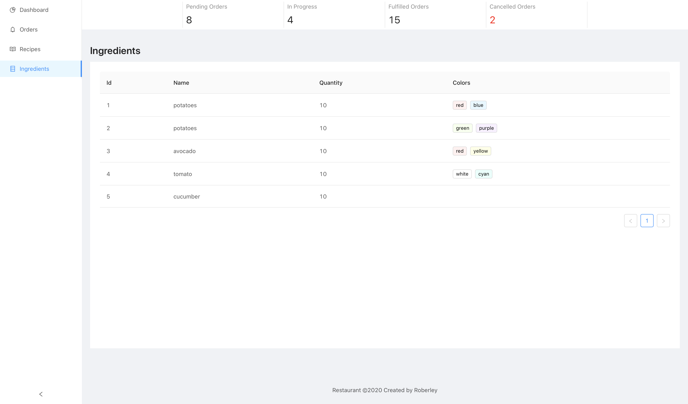

# Restaurant Desktop APP

#### Problem to solve:

A restaurant needs to keep track on how many ingredients it has left in stock after each order has been placed.
They also want to know how many times a recipe has been ordered.
You are being tasked with building a ui that will let management keep track of these things.

Although management is willing to give you creative freedom they do have certain demands and requirements:

Main requirements(Actual assignment):  
1 - Management is a big fan of Facebook and has heard of this thing called React so they want you to use it 
2 - Management wants to be able to see in the same screen pending orders and items inventory 
3 - Management would like to have a top bar where the number of cancelled, pending, in progress and fulfilled orders is visible 
4 - An order should not be created if not all the items are in stock 

Nice to Have Requirements: 
1 - Management has read some tech blogs and learned about TypeScript and would like it to be used 
1 - Management likes filtering things, so he would like to be able to filter the items by color; 
2 - Management wants to be able to cancel an order that is in pending state within 3 minutes of the order being created. 
3 - An order should be in pending state when first created and transitioned into in progress state after 3 minutes of being created. 

All this is supported by the apis the manager wrote and the documentation can be found here
https://app.swaggerhub.com/apis/d65yan/restaurant/0.0.0

The Manager does not have a development environment so anything you can do to make it easier to view the code and the running result would be highly appreciated.

## Options
development: `npm start`  
deployment: `npm run build`, `npm run serve`  
demo: http://35.196.91.62/ingredients

# Tech Stacks
<ul>
    <li>Typescript</li>
    <li>React.js</li>
    <li>Ant-Design</li>
    <li>Redux</li>
    <li>Redux-Saga</li>
    <li>React-Router</li>
    <li>Docker</li>
    <li>Kubernetes</li>
    <li>CI/CD</li>
    <li>Google Cloud</li>
</ul>
